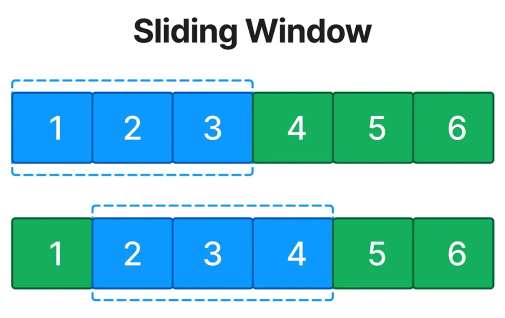

# 🧠 Algorithm Patterns in Java

A refillable collection of **essential algorithm patterns** with real-world business cases and Java implementations.
Each pattern includes clear explanations, complexity analysis, and links on the LeetCode problems.

## 🎯 Purpose

This repository is my personal journey mastering algorithm patterns. It's designed to:
- **Bridge the gap** between theoretical algorithms and real business problems
- **Provide ready-to-use Java templates** for each pattern
- **Serve as interview preparation** material

## 📚 Patterns Covered

| # | Pattern | Difficulty | Business Case | LeetCode | Image                                                              |
|---|---------|------------|---------------|----------|--------------------------------------------------------------------|
| 1 | [Sliding Window](./src/sliding_window_1/README.md) | 🟢 🔵 🔴 | Some store optimization | #643, #209, #239 |  |
| 2 | [Two Pointers]() | 🟢 🔵 🔴 | In Progress | In Progress |                 |