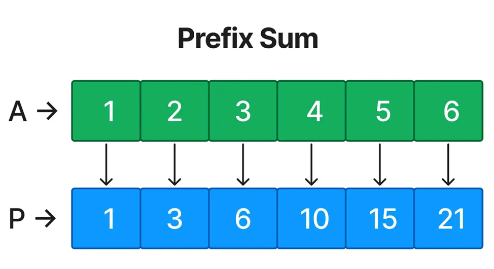

# 🧠 Algorithm Patterns in Java

A refillable collection of **essential algorithm patterns** with real-world business cases and Java implementations.
Each pattern includes clear explanations, complexity analysis, and links on the LeetCode problems.

## 🎯 Purpose

This repository is my personal journey mastering algorithm patterns. It's designed to:
- **Bridge the gap** between theoretical algorithms and real business problems
- **Provide ready-to-use Java templates** for each pattern
- **Serve as interview preparation** material

## 📚 Patterns Covered

| # | Pattern                                            | Difficulty | Business Case                 | LeetCode         | Label                                                              |
|---|----------------------------------------------------|------------|-------------------------------|------------------|--------------------------------------------------------------------|
| 1 | [Sliding Window](./src/sliding_window_1/README.md) | 🟢 🔵 🔴 | Store optimization            | #643, #209, #239 |  |
| 2 | [Two Pointers]( ./src/two_pointer_2/README.md)     | 🟢 🔵 🔴 | Delivery company optimization | #125, #15, #42   |     |
| 3 | [Prefix Sum]()                                     | 🟢 🔵 🔴 | In Progress                   | In Progress      |      |